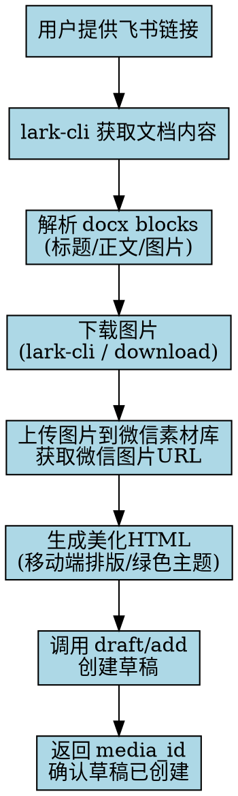

# 微信公众号 Skill (WeChat MP Skill)

> Claude Code / OpenCode Skill — 内容创作 + API 自动化操作微信公众号

## 功能概览

| 模块 | 能力 | 需要认证 |
|------|------|----------|
| 📝 内容创作 | 文章撰写、标题优化、排版建议 | 否 |
| 🔗 链接转草稿 | 飞书/网页 → 自动抓取 → 生成草稿 | 是 |
| 🖼️ 素材管理 | 上传/管理永久/临时素材 | 是 |
| 📄 草稿管理 | 创建/管理/发布草稿 | 是 |
| 📢 群发消息 | 按标签/全量群发 | 是 |
| 📋 自定义菜单 | 创建/查询/删除菜单 | 是 |
| 👥 用户管理 | 粉丝列表/标签/备注 | 是 |
| 💬 评论管理 | 查看/精选/删除/回复评论 | 是 |
| 📨 模板消息 | 发送订阅通知 | 是 |

## 快速开始

### 1. 安装 Skill

```bash
# 方法一：直接安装（推荐）
npx skills add zackzhangkai/wechat-mp-skill -g -y

# 方法二：手动克隆
git clone git@github.com:zackzhangkai/wechat-mp-skill.git ~/.claude/skills/wechat-mp
```

### 2. 配置凭证

```bash
# 在微信公众平台 > 开发 > 基本配置 获取
export WX_MP_APPID="你的AppID"
export WX_MP_SECRET="你的AppSecret"

# 可选：指定配置文件路径（默认 ~/.wechat-mp.json）
export WX_MP_CONFIG="/path/to/config.json"
```

> ⚠️ **重要**：需在公众平台 > 开发 > 基本配置 > IP白名单 中添加当前服务器 IP。

### 3. 触发 Skill

在 Claude Code / OpenCode 对话中提及：

- "写篇公众号文章"
- "把链接搬进公众号" / "链接转草稿"
- "发布公众号内容"
- "群发消息" / "自定义菜单"

---

## 核心功能详解

### 🔗 链接转草稿（Link to Draft）

**支持两种来源：**

#### 飞书文档 → 公众号草稿

```
用户：把 https://my.feishu.cn/wiki/XXX 搬到公众号草稿箱
```

**完整流程（自动执行）：**



**技术细节：**
- 文档类型识别：通过 `lark-cli api GET /open-apis/wiki/v2/spaces/{space}/nodes/{token}` 获取 `obj_type`
- 内容解析：docx 文档通过 `/open-apis/docx/v1/documents/{token}/blocks` 获取 blocks
- 图片处理：block_type=27 为图片，token 通过 `/open-apis/drive/v1/medias/{token}/download` 下载
- 微信上传：图片转 base64 或直接上传至 `/cgi-bin/material/add_material`
- HTML 美化：15px 字体、1.8 行高、#07C160 绿色主题、移动端适配

#### 普通网页 → 公众号草稿

```
用户：把这个链接 https://example.com 转成公众号草稿
```

使用 `webfetch` 抓取公开页面，自动提取：
- `<title>` 或 `og:title` → 文章标题（≤32字符）
- `meta description` 或 `og:description` → 摘要（≤128字符）
- `og:image` → 封面图
- 正文内容 → 转换为公众号兼容 HTML

---

### 📝 内容创作

**标题规范（≤32字符）：**
- 数字开头："5个技巧..."、"2026年趋势..."
- 疑问句："为什么...？"、"如何...？"
- 悬念式："原来...才是关键"
- 痛点式："还在...？你已经落后了"

**正文规范（<20000字符, <1MB）：**
- 支持 HTML 标签
- 移动端为主，短段落优先
- 每2-3句换行，关键信息加粗

**输出变体：**
- 版本A：直接干货型
- 版本B：故事引入型
- 版本C：痛点解决型

---

### 📄 API 操作

#### 获取 Access Token

```bash
# 稳定接口（推荐）
curl -X POST https://api.weixin.qq.com/cgi-bin/stable_token \
  -H "Content-Type: application/json" \
  -d '{"grant_type":"client_credential","appid":"APPID","secret":"APPSECRET"}'

# 传统接口
curl "https://api.weixin.qq.com/cgi-bin/token?grant_type=client_credential&appid=APPID&secret=APPSECRET"
```

#### 创建草稿

```bash
curl -X POST "https://api.weixin.qq.com/cgi-bin/draft/add?access_token=TOKEN" \
  -H "Content-Type: application/json" \
  -d '{
    "articles": [{
      "title": "标题(≤32字符)",
      "author": "作者(≤16字符)",
      "digest": "摘要(≤128字符)",
      "content": "<p>HTML正文</p>",
      "content_source_url": "原文链接",
      "thumb_media_id": "封面图media_id",
      "need_open_comment": 1,
      "only_fans_can_comment": 0
    }]
  }'
# 返回: {"media_id": "DRAFT_MEDIA_ID"}
```

#### 发布草稿

```bash
# 提交发布（异步）
curl -X POST "https://api.weixin.qq.com/cgi-bin/freepublish/submit?access_token=TOKEN" \
  -d '{"media_id": "DRAFT_MEDIA_ID"}'

# 查询状态
curl -X POST "https://api.weixin.qq.com/cgi-bin/freepublish/publish?access_token=TOKEN" \
  -d '{"publish_id": "PUBLISH_ID"}'
```

---

## 微信公众号排版规范

本 Skill 内置的 HTML 样式遵循以下规范：

| 元素 | 样式 |
|------|------|
| 标题 | 22px，粗体，居中，#333 |
| 小标题 | 18px，#07C160，左绿色边框 |
| 正文 | 15px，行高 1.8，#333 |
| 引用块 | 浅灰背景，绿色左边框 |
| 代码块 | #f6f8fa 背景，等宽字体 |
| 图片 | 居中，max-width:100%，圆角 |
| 分割线 | 渐变绿色 (#07C160 → #38D47E) |

---

## 常见错误码

| 错误码 | 含义 | 处理方法 |
|--------|------|----------|
| 40001 | Access Token 无效 | 重新获取 token |
| 40164 | IP 不在白名单 | 在公众平台添加服务器 IP |
| 48001 | API未授权 | 检查账号类型和认证状态 |
| 45009 | 接口调用超过限制 | 调整频率，启用缓存 |
| 53503 | 发布检查失败 | 修改文章内容后重试 |
| 40007 | 无效的 media_id | 重新上传素材 |

---

## 完整工作流示例

### 从飞书文档到公众号草稿

```bash
# 1. 用户提供飞书维基链接
URL="https://my.feishu.cn/wiki/ONBMwTICRiVBzJkek7RczorgnNh"

# 2. 提取 node_token
node_token="ONBMwTICRiVBzJkek7RczorgnNh"

# 3. 获取文档信息（找到 space_id 和 obj_token）
lark-cli api GET /open-apis/wiki/v2/spaces/{space_id}/nodes/${node_token}

# 4. 获取文档 blocks
lark-cli api GET /open-apis/docx/v1/documents/{obj_token}/blocks --page-all

# 5. 下载图片并上传到微信素材库
# （脚本自动处理）

# 6. 生成美化 HTML 并创建草稿
# （脚本自动处理）

# 结果：
# ✅ 草稿已创建，media_id: vbrpO6ndip5ZEC8y2jzGQJusMghyYrvmfUm4VxYimn1R8NtJtZeC4msx7qBuFoUq
# 📝 标题：基于OpenClaw的PPT生成实战演示-从翻车到成功实录
# 📄 摘要：本以为10分钟能完成，结果翻车2小时...
# 🖼️ 图片：11张已上传并嵌入
```

---

## 免责声明

- 本 Skill 仅生成内容和提供 API 参考，不自动执行敏感操作
- 群发、发布等操作需用户明确确认后执行
- 用户需自行判断内容合规性
- 不涉及刷量、诱导关注等违规行为

---

## 相关链接

- 仓库地址：https://github.com/zackzhangkai/wechat-mp-skill
- 微信公众平台：https://mp.weixin.qq.com
- 飞书开放平台：https://open.feishu.cn

---

MIT (c) 2026 zackzhangkai
