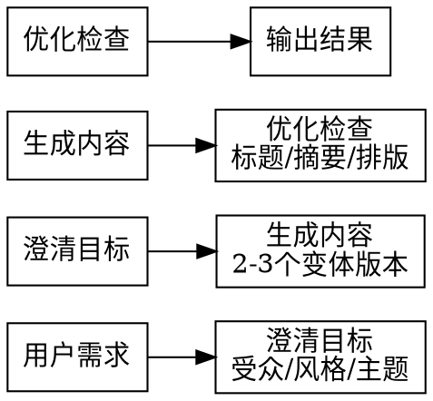
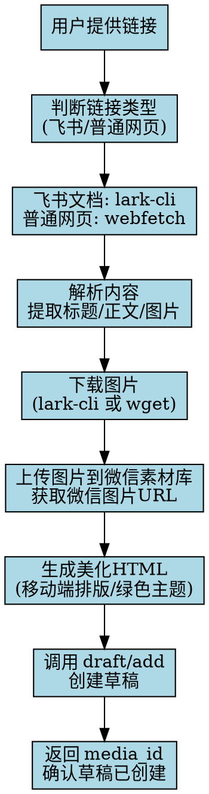

# 微信公众号 Skill

内容创作 + API 自动化操作 Claude Code Skill。

## 触发关键词

- "微信公众号" / "公众号" / "WeChat MP"
- "写篇公众号文章"
- "发布公众号内容"
- "群发消息" / "模板消息"
- "自定义菜单"
- "公众号素材管理"
- "链接转草稿" / "把链接搬进公众号" / "url to draft"
- "抓取网页发公众号"

## 前置配置

使用 API 功能前，需要配置环境变量：

```bash
# 必填 - 在微信公众平台 > 开发 > 基本配置 获取
export WX_MP_APPID="你的AppID"
export WX_MP_SECRET="你的AppSecret"

# 可选 - 指定配置文件路径（默认 ~/.wechat-mp.json）
export WX_MP_CONFIG="/path/to/config.json"
```

首次运行时执行 `/wechat-mp` 初始化配置向导。

## 核心能力

| 模块 | 能力 | 需要认证 |
|------|------|----------|
| 内容创作 | 文章撰写、标题优化、排版建议 | 否 |
| 素材管理 | 上传/管理永久/临时素材 | 是 |
| 草稿管理 | 创建/管理/发布草稿 | 是 |
| 群发消息 | 按标签/全量群发 | 是 |
| 自定义菜单 | 创建/查询/删除菜单 | 是 |
| 用户管理 | 粉丝列表/标签/备注 | 是 |
| 评论管理 | 查看/精选/删除/回复评论 | 是 |
| 模板消息 | 发送订阅通知 | 是 |

## 工作流

### 内容创作（无需API）



#### Step 1: 需求澄清

询问用户：
1. **主题** - 写什么？
2. **受众** - 垂直领域？粉丝画像？
3. **风格** - 专业/故事/干货/幽默？
4. **目标** - 阅读/转发/涨粉/品牌？
5. **格式** - 长图文/短图文/图片消息？

#### Step 2: 内容生成

遵循微信公众号内容规范：

**标题（最多32字符）：**
- 数字开头："5个技巧..."、"2026年趋势..."
- 疑问句："为什么...？"、"如何...？"
- 悬念式："原来...才是关键"
- 痛点式："还在...？你已经落后了"

**摘要（最多128字符）：**
- 3秒决定读者是否点开
- 放核心价值或悬念

**正文（<20000字符, <1MB）：**
- 支持HTML标签
- 移动端为主，短段落优先
- 每2-3句换行
- 关键信息加粗

#### Step 3: 优化检查

- [ ] 标题 ≤ 32字符且有吸引力
- [ ] 摘要 ≤ 128字符
- [ ] 正文 < 20000字符
- [ ] 移动端可读性（短段落、适当留白）
- [ ] CTA 明确（引导关注/转发/留言）

#### Step 4: 变体输出

提供 2-3 个版本：
- **版本A**: 直接干货型
- **版本B**: 故事引入型
- **版本C**: 痛点解决型

### 链接转草稿（需要API）



---

## 飞书文档 → 公众号草稿（完整实战流程）

### 适用场景
- 飞书维基链接：`https://my.feishu.cn/wiki/NODE_TOKEN`
- 飞书文档（docx）：需要登录，webfetch 无法抓取，必须用 `lark-cli`

### Step 1: 前置准备

```bash
# 1. 检查 lark-cli 是否安装
which lark-cli || echo "未安装，请先安装: npm install -g @larksuite/cli"

# 2. 检查微信公众平台凭证
echo "AppID: $WX_MP_APPID"
echo "AppSecret: ${WX_MP_SECRET:+已配置}"  # 未配置则需设置环境变量

# 3. 确保微信 API IP 白名单已添加（公众号后台 > 开发 > 基本配置）
```

### Step 2: 获取飞书文档内容

**从 URL 提取 node_token：**
```
URL: https://my.feishu.cn/wiki/ONBMwTICRiVBzJkek7RczorgnNh
node_token = ONBMwTICRiVBzJkek7RczorgnNh
```

**查找文档所在空间和类型：**
```bash
# 列出所有 wiki 空间，找到对应的 space_id
lark-cli api GET /open-apis/wiki/v2/spaces --format json

# 获取节点详情（找到 space_id 和 obj_token/obj_type）
# node_token 从 URL 中获得
lark-cli api GET /open-apis/wiki/v2/spaces/{space_id}/nodes/{node_token} --format json

# 返回示例：
# {
#   "node_type": "origin",
#   "obj_type": "docx",  # 文档类型：docx / doc / sheet 等
#   "obj_token": "MRyhdQ4agoYiNxxa922cTRX3nSd",
#   "title": "文档标题"
# }
```

**获取 docx 文档内容和图片：**
```bash
# 获取文档所有 blocks（包含正文和图片）
lark-cli api GET /open-apis/docx/v1/documents/{obj_token}/blocks --page-all --format json > /tmp/feishu_doc_blocks.json

# blocks 数据结构：
# - block_type=1: page（标题）
# - block_type=2: text（段落）
# - block_type=3/4/5: heading1/2/3（标题）
# - block_type=27: image（图片，token 在 image.token）
# - block_type=6: bullet（无序列表）
# - block_type=8: code（代码块）
# - block_type=9: quote（引用）
```

### Step 3: 解析 Blocks 为 HTML

```python
# /tmp/parse_feishu.py - 解析飞书 docx blocks 为 HTML
import json

with open('/tmp/feishu_doc_blocks.json', 'r') as f:
    data = json.load(f)

blocks = data['data']['items']
block_map = {b['block_id']: b for b in blocks}

def text_elements_to_html(elements):
    html = ""
    for el in elements:
        if 'text_run' in el:
            content = el['text_run'].get('content', '')
            style = el['text_run'].get('text_element_style', {})
            if style.get('bold'): content = f'<strong>{content}</strong>'
            if style.get('italic'): content = f'<em>{content}</em>'
            html += content
        elif 'mention_doc' in el:
            title = el['mention_doc'].get('title', '链接')
            url = el['mention_doc'].get('url', '#')
            html += f'<a href="{url}">{title}</a>'
    return html

def block_to_html(block):
    block_type = block.get('block_type', 0)
    result = ""
    if block_type == 1:  # page title
        elements = block.get('page', {}).get('elements', [])
        text = text_elements_to_html(elements)
        if text.strip():
            result += f'<h1>{text}</h1>\n'
    elif block_type == 2:  # paragraph
        elements = block.get('text', {}).get('elements', [])
        content = text_elements_to_html(elements)
        if content.strip():
            result += f'<p>{content}</p>\n'
    elif block_type == 3:  # heading1
        elements = block.get('heading1', {}).get('elements', [])
        content = text_elements_to_html(elements)
        if content.strip():
            result += f'<h2>{content}</h2>\n'
    elif block_type == 27:  # image
        img = block.get('image', {})
        token = img.get('token', '')
        result += f'[IMG:{token}]\n'  # 占位符，后续替换
    # 处理子节点
    for child_id in block.get('children', []):
        if child_id in block_map:
            result += block_to_html(block_map[child_id])
    return result

html_content = block_to_html(blocks[0])
print(html_content)
```

### Step 4: 下载图片并上传到微信素材库

```bash
# 1. 从 blocks 中提取所有图片 token
python3 << 'PYEOF'
import json
with open('/tmp/feishu_doc_blocks.json') as f:
    data = json.load(f)
tokens = []
for b in data['data']['items']:
    if b.get('block_type') == 27:
        token = b.get('image', {}).get('token', '')
        if token: tokens.append(token)
print('\n'.join(tokens))
PYEOF

# 2. 下载图片（使用 lark-cli，必须在目标目录执行）
mkdir -p /tmp/wechat_images && cd /tmp/wechat_images
# 对每个 token 执行：
lark-cli api GET "/open-apis/drive/v1/medias/{token}/download" -o "img_{n}.jpg"

# 3. 上传图片到微信素材库（获取 access_token）
ACCESS_TOKEN=$(curl -s "https://api.weixin.qq.com/cgi-bin/token?grant_type=client_credential&appid=${WX_MP_APPID}&secret=${WX_MP_SECRET}" | python3 -c "import sys,json;print(json.load(sys.stdin)['access_token'])")

# 上传每张图片
for img in /tmp/wechat_images/img_*.jpg; do
    result=$(curl -s -X POST "https://api.weixin.qq.com/cgi-bin/material/add_material?access_token=${ACCESS_TOKEN}&type=image" -F "media=@${img}")
    echo "Uploaded $img: $(echo $result | python3 -c "import sys,json;d=json.load(sys.stdin);print(d.get('url',''))")"
done

# 保存 token -> wechat_url 映射，用于替换 HTML 中的图片占位符
```

### Step 5: 生成美化后的公众号 HTML

```python
# 微信公众号排版规范：
# - 字体：15px，行高 1.8，移动端优先
# - 标题：22px 加粗，居中
# - 小标题：18px，左对齐，绿色 (#07C160) 左边框
# - 图片：居中，max-width:100%
# - 引用块：浅灰背景，绿色左边框
# - 代码块：#f6f8fa 背景，等宽字体

# 完整美化 HTML 模板结构：
html_template = """<section style="padding:16px 16px 32px;background:#fff;font-family:-apple-system,BlinkMacSystemFont,sans-serif;">
  <!-- 标题区 -->
  <section style="text-align:center;padding:30px 20px 20px;">
    <h1 style="font-size:22px;font-weight:bold;color:#333;margin:0 0 15px;">{title}</h1>
    <p style="font-size:13px;color:#999;margin:0;">{author}</p>
    <section style="height:3px;background:linear-gradient(to right,#07C160,#38D47E);margin:20px auto 0;width:60px;"></section>
  </section>
  
  <!-- 正文 -->
  {content}
  
  <!-- 结尾 -->
  <section style="margin:32px 0 16px;text-align:center;">
    <section style="height:1px;background:#eee;margin-bottom:16px;"></section>
    <p style="font-size:13px;color:#999;margin:0;">— END —</p>
  </section>
</section>"""
```

### Step 6: 创建草稿

```python
import json, urllib.request

# 获取 access_token
def get_token():
    url = f"https://api.weixin.qq.com/cgi-bin/token?grant_type=client_credential&appid={WX_MP_APPID}&secret={WX_MP_SECRET}"
    with urllib.request.urlopen(url) as resp:
        return json.loads(resp.read())['access_token']

# 读取美化后的 HTML
with open('/tmp/wechat_images/content_final.html') as f:
    html_content = f.read()

# 构造草稿数据
payload = {
    "articles": [{
        "title": "文档标题（≤32字符）",
        "author": "技术自留地（≤16字符）",
        "digest": "摘要（≤128字符，从正文前100字生成）",
        "content": html_content,
        "content_source_url": "飞书原文链接",
        "thumb_media_id": "封面图 media_id（第一张图片）",
        "need_open_comment": 1,
        "only_fans_can_comment": 0
    }]
}

# 发送请求
token = get_token()
data = json.dumps(payload, ensure_ascii=False).encode('utf-8')
req = urllib.request.Request(
    f"https://api.weixin.qq.com/cgi-bin/draft/add?access_token={token}",
    data=data,
    headers={'Content-Type': 'application/json; charset=utf-8'},
    method='POST'
)
with urllib.request.urlopen(req) as resp:
    result = json.loads(resp.read())
    print(f"✅ 草稿已创建！media_id: {result['media_id']}")
```

---

## 普通网页 → 公众号草稿

### Step 1: 抓取网页内容

使用 `webfetch` 工具（无需登录的公开页面）：
- 页面标题 → 公众号文章标题候选（≤32字符）
- 正文内容 → HTML 或 Markdown
- OG 图片 → 封面候选
- Meta description → 摘要候选（≤128字符）

### Step 2: 检查并补充信息

询问用户（无法自动提取时）：
1. **标题**（≤32字符）
2. **摘要**（≤128字符）
3. **封面图**（URL 或本地路径）
4. **作者**（≤16字符，默认公众号名称）

### Step 3: 内容转换

**转换规则：**
- 保留段落结构，每2-3句换行
- 图片：下载 → 上传微信素材库 → 替换 `src` 为微信 URL
- 外链：保留（微信可能屏蔽部分外链）
- 代码块：`<pre><code>` 包裹
- 标题：`<h1>` 改为 `<h2>`，避免过大

### Step 4: 创建草稿

```bash
curl -X POST "https://api.weixin.qq.com/cgi-bin/draft/add?access_token=TOKEN" \
  -H "Content-Type: application/json" \
  -d '{
    "articles": [{
      "title": "标题(≤32字符)",
      "author": "作者(≤16字符)",
      "digest": "摘要(≤128字符)",
      "content": "<p>美化后的HTML正文</p>",
      "content_source_url": "原始链接",
      "thumb_media_id": "封面MEDIA_ID",
      "need_open_comment": 1,
      "only_fans_can_comment": 0
    }]
  }'
# 返回: {"media_id": "DRAFT_MEDIA_ID"}
```

---

### 确认结果

输出：
- ✅ 草稿已创建，media_id: `xxx`
- 📝 标题：`xxx`
- 📄 摘要：`xxx`
- 🖼️ 封面：`已上传`
- 🔗 原文链接：`xxx`

提示用户：可登录 [mp.weixin.qq.com](https://mp.weixin.qq.com) 查看草稿，或继续操作（发布/群发）。

### API 操作（需要认证）

#### 获取 Access Token

```bash
# 使用稳定 token 接口（推荐）
curl -X POST https://api.weixin.qq.com/cgi-bin/stable_token \
  -H "Content-Type: application/json" \
  -d '{"grant_type":"client_credential","appid":"APPID","secret":"APPSECRET","force_refresh":false}'

# 使用传统 token 接口
curl "https://api.weixin.qq.com/cgi-bin/token?grant_type=client_credential&appid=APPID&secret=APPSECRET"
```

**Token 规则：**
- 有效期 7200 秒（2小时）
- 稳定接口：10,000次/分钟，500,000次/天
- 强制刷新：20次/天，间隔≥30秒
- 推荐缓存 token，过期前5分钟刷新

#### 上传素材

```bash
# 上传永久图片素材
curl -X POST "https://api.weixin.qq.com/cgi-bin/material/add_material?access_token=TOKEN&type=image" \
  -F "media=@/path/to/image.jpg"

# 返回: {"media_id": "MEDIA_ID", "url": "IMAGE_URL"}
```

**素材限制：**
- 图片：PNG/JPEG/JPG/GIF，≤2MB
- 语音：AMR/MP3，≤2MB，时长≤60分钟
- 视频：MP4，≤10MB
- 缩略图：JPG，≤64KB

#### 创建草稿

```bash
curl -X POST "https://api.weixin.qq.com/cgi-bin/draft/add?access_token=TOKEN" \
  -H "Content-Type: application/json" \
  -d '{
    "articles": [{
      "title": "标题(≤32字符)",
      "author": "作者(≤16字符)",
      "digest": "摘要(≤128字符)",
      "content": "<p>HTML正文</p>",
      "thumb_media_id": "封面图media_id",
      "need_open_comment": 1,
      "only_fans_can_comment": 0
    }]
  }'
# 返回: {"media_id": "MEDIA_ID"}
```

**注意：** 每条消息1-8篇文章。

#### 发布草稿

```bash
# 提交发布（异步）
curl -X POST "https://api.weixin.qq.com/cgi-bin/freepublish/submit?access_token=TOKEN" \
  -d '{"media_id": "MEDIA_ID"}'
# 返回: {"publish_id": "PUBLISH_ID"}

# 查询发布状态
curl -X POST "https://api.weixin.qq.com/cgi-bin/freepublish/publish?access_token=TOKEN" \
  -d '{"publish_id": "PUBLISH_ID"}'
```

#### 群发消息

```bash
# 发给所有用户
curl -X POST "https://api.weixin.qq.com/cgi-bin/message/mass/sendall?access_token=TOKEN" \
  -H "Content-Type: application/json" \
  -d '{
    "filter": {"is_to_all": true},
    "msgtype": "text",
    "text": {"content": "群发内容"}
  }'

# 发给指定标签用户
curl -X POST "https://api.weixin.qq.com/cgi-bin/message/mass/sendall?access_token=TOKEN" \
  -H "Content-Type: application/json" \
  -d '{
    "filter": {"is_to_all": false, "tag_id": "TAG_ID"},
    "msgtype": "mpnews",
    "mpnews": {"media_id": "MEDIA_ID"}
  }'

# 发给指定用户（最多10000个openid）
curl -X POST "https://api.weixin.qq.com/cgi-bin/message/mass/send?access_token=TOKEN" \
  -H "Content-Type: application/json" \
  -d '{
    "touser": ["OPENID1", "OPENID2"],
    "msgtype": "text",
    "text": {"content": "内容"}
  }'
```

**群发类型：** `text` / `image` / `voice` / `mpnews` / `mpvideo` / `wxcard`
**去重：** 使用 `clientmsgid`（32字节）在24小时窗口内去重

#### 自定义菜单

```bash
# 创建菜单（最多3个一级按钮，每个最多5个子按钮）
curl -X POST "https://api.weixin.qq.com/cgi-bin/menu/create?access_token=TOKEN" \
  -H "Content-Type: application/json" \
  -d '{
    "button": [
      {
        "type": "view",
        "name": "官网",
        "url": "https://example.com"
      },
      {
        "name": "服务",
        "sub_button": [
          {"type": "click", "name": "关于我们", "key": "ABOUT"},
          {"type": "view", "name": "联系客服", "url": "https://example.com/contact"}
        ]
      }
    ]
  }'

# 查询当前菜单
curl "https://api.weixin.qq.com/cgi-bin/menu/get?access_token=TOKEN"

# 删除菜单
curl "https://api.weixin.qq.com/cgi-bin/menu/delete?access_token=TOKEN"
```

**按钮类型：** `click`(事件) / `view`(URL) / `miniprogram`(小程序) / `scancode_push` / `scancode_waitmsg` / `pic_sysphoto` / `pic_photo_or_album` / `pic_weixin` / `location_select` / `media_id`

#### 用户管理

```bash
# 获取粉丝列表（每次最多10000个openid）
curl "https://api.weixin.qq.com/cgi-bin/user/get?access_token=TOKEN&next_openid="

# 获取单个用户信息
curl "https://api.weixin.qq.com/cgi-bin/user/info?access_token=TOKEN&openid=OPENID&lang=zh_CN"

# 批量获取用户信息（最多100个）
curl -X POST "https://api.weixin.qq.com/cgi-bin/user/info/batchget?access_token=TOKEN" \
  -d '{"user_list": [{"openid": "OPENID", "lang": "zh_CN"}]}'
```

**注意：** 2021年12月27日起不再返回头像/昵称。

#### 评论管理

```bash
# 查看评论（type: 0=全部, 1=普通, 2=精选）
curl -X POST "https://api.weixin.qq.com/cgi-bin/comment/list?access_token=TOKEN" \
  -d '{"msg_data_id": MSG_ID, "index": 0, "begin": 0, "count": 50, "type": 0}'

# 加精/取消加精
curl -X POST "https://api.weixin.qq.com/cgi-bin/comment/markelect?access_token=TOKEN" \
  -d '{"msg_data_id": MSG_ID, "index": 0, "user_comment_id": COMMENT_ID}'
curl -X POST "https://api.weixin.qq.com/cgi-bin/comment/unmarkelect?access_token=TOKEN" \
  -d '{"msg_data_id": MSG_ID, "index": 0, "user_comment_id": COMMENT_ID}'

# 开放/关闭评论
curl -X POST "https://api.weixin.qq.com/cgi-bin/comment/open?access_token=TOKEN" \
  -d '{"msg_data_id": MSG_ID, "index": 0}'
curl -X POST "https://api.weixin.qq.com/cgi-bin/comment/close?access_token=TOKEN" \
  -d '{"msg_data_id": MSG_ID, "index": 0}'

# 回复评论
curl -X POST "https://api.weixin.qq.com/cgi-bin/comment/reply/add?access_token=TOKEN" \
  -d '{"msg_data_id": MSG_ID, "index": 0, "user_comment_id": COMMENT_ID, "content": "回复内容"}'
```

#### 订阅消息

```bash
curl -X POST "https://api.weixin.qq.com/cgi-bin/message/template/subscribe?access_token=TOKEN" \
  -H "Content-Type: application/json" \
  -d '{
    "touser": "OPENID",
    "template_id": "TEMPLATE_ID",
    "url": "https://example.com",
    "scene": "1000",
    "title": "订阅通知标题(≤15字符)",
    "data": {
      "content": {"value": "通知内容(≤200字符)", "color": "#FF0000"}
    }
  }'
```

#### API 额度查询

```bash
curl -X POST "https://api.weixin.qq.com/cgi-bin/openapi/quota/get?access_token=TOKEN" \
  -d '{"cgi_path": "/cgi-bin/message/custom/send"}'
# 返回: {"daily_limit": N, "used": N, "remain": N}
```

## 常见错误码

| 错误码 | 含义 | 处理方法 |
|--------|------|----------|
| 40001 | Access Token 无效 | 重新获取 token |
| 40164 | IP 不在白名单 | 在公众平台添加服务器IP |
| 48001 | API未授权 | 检查账号类型和认证状态 |
| 45009 | 接口调用超过限制 | 调整频率，启用缓存 |
| 53503 | 发布检查失败 | 修改文章内容后重试 |
| 40007 | 无效的 media_id | 重新上传素材 |

## 完整工作流示例

### 从创作到发布

1. **内容创作** → 生成文章HTML + 标题 + 摘要
2. **上传封面图** → `add_material` 获取 `thumb_media_id`
3. **创建草稿** → `draft/add` 获取 `media_id`
4. **预览检查** → 确认内容无误
5. **发布** → `freepublish/submit` 提交发布
6. **状态确认** → 等待 `PUBLISHJOBFINISH` 回调或查询发布状态

### 注意事项

- 群发消息是异步操作，返回成功仅表示任务已提交
- 通过 draft 获取的 media_id 在群发成功后会失效
- 许多API仅认证服务号可用
- 自定义菜单名称最多5个中文字符
- 客服消息需在用户互动后48小时内发送
- URL 链接需要ICP备案

## 免责声明

- 本 Skill 仅生成内容和提供API参考，不自动执行敏感操作
- 群发、发布等操作需用户明确确认后执行
- 用户需自行判断内容合规性
- 不涉及刷量、诱导关注等违规行为

---

MIT (c) 2026